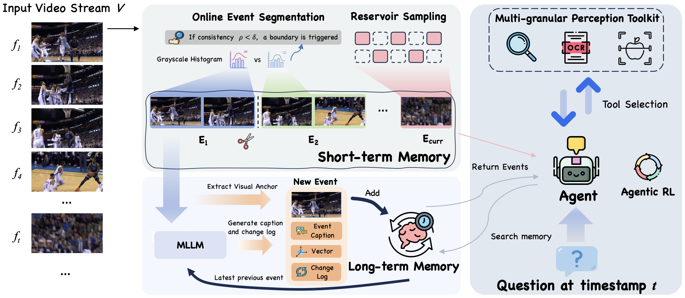

# EventMemAgent: Hierarchical Event-Centric Memory for Online Video Understanding with Adaptive Tool Use
<div align="center">

[Siwei Wen](https://scholar.google.com/citations?user=kJRiUYwAAAAJ&hl=zh-CN),
Zhangcheng Wang,
[Xingjian Zhang](https://scholar.google.com/citations?user=H34fwioAAAAJ&hl=zh-CN), 
[Lei Huang](https://huangleibuaa.github.io/), 
[Wenjun Wu](https://openreview.net/profile?id=~wenjun_wu3), 

[](https://arxiv.org/abs/2602.15329) 
[](https://hits.seeyoufarm.com)

</div>

## 📰 News
- **[2025.2.20]**: 🔥 We have released **EventMemAgent: Hierarchical Event-Centric Memory for Online Video Understanding with Adaptive Tool Use**. Check out the [paper](hhttps://arxiv.org/abs/2602.15329). Our code will come soon.

## EventMemAgent Overview
<div align="center">

</div>
EventMemAgent is an active online video agent framework based on hierarchical memory. It employs a dual-layer strategy: short-term memory detects event boundaries and uses event-granular reservoir sampling; long-term memory archives past observations on an event-by-event basis. The framework integrates a multi-granular perception toolkit (search_memory, OCR, object detection) and supports Agentic RL for end-to-end reasoning and tool-use strategies.

- **Short-term memory**: Event boundary detection + reservoir sampling within a fixed-length buffer
- **Long-term memory**: Structured event-by-event archival with captions and change descriptions
- **Tools**: `search_memory`, `ocr`, `detect_objects` for active evidence capture


## Citation

```bibtex
@article{wen2026eventmemagent,
  title={EventMemAgent: Hierarchical Event-Centric Memory for Online Video Understanding with Adaptive Tool Use},
  author={Wen, Siwei and Wang, Zhangcheng and Zhang, Xingjian and Huang, Lei and Wu, Wenjun},
  journal={arXiv preprint arXiv:2602.15329},
  year={2026}
}
```
